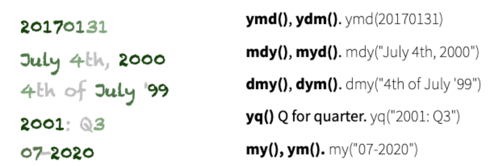

class: middle, inverse, center
# Working with date and time

```{r setup, include=FALSE}
knitr::opts_chunk$set(echo = TRUE)
library(tidyverse)
library(lubridate)
```


---

# `lubridate` package

- package for working with dates and times

- defines different classes of time: instants, periods, intervals, durations

- defines converter and accessor functions, enables time calculus

---

# Converter functions and instants in time

- time instants: one (absolute) moment in time, e.g. `now()`, `Jan-1-2000`

- easy-to-use converter functions: 
    - date: `ymd`, `mdy`, `dmy`, ...
    - time: `hm`, `hms`, ...
    - date & time: `ymd_hms`, `mdy_hm`, ...

- order of letters determines how strings are parsed

- separators are automatically determined, then assumed to be the same

Example:
```{r message=FALSE}
mdy("10-17-2022")
```

---

# Conversion functions

[lubridate package cheat sheet](https://github.com/rstudio/cheatsheets/raw/main/lubridate.pdf)



---
class: inverse
# Your Turn 

- Create date objects for today's date by typing the date in text format and converting it with one of the `lubridate` converter functions. 

- Try different formats of writing the date and compare the end results.

---

# Example: Ames Liquor Sales

```{r, message=FALSE}
ames <- readRDS("data/ames-liquor.rds")

summary(ames$Date) # pretty uninformative 
ames$Date <- lubridate::mdy(ames$Date)
summary(ames$Date) # allows time algebra
```


---

# Accessor functions


- accessor functions: `year`, `month`, `week`, `wday`, `mday`, `yday`, `hour`, `minute`, ...

- accessor functions can also be used for setting elements of date and time, e.g. `hour(x) <- 12`

Examples:

```{r}
month(now())
wday(now(), label = TRUE)
```

---

# Intervals and Durations

- Intervals have a *start* and an *end* date/time: absolute difference

- Durations are potentially of relative length (months, leap year, leap second, ...)

```{r}
end_date <- now()
# span is interval, years(1) is duration
span <- end_date - years(1)
span
end_date - days(10)
```


---
class: inverse
# Your Turn: Iowa Liquor Sales (cont'd)

Use the `ames` data  to answer the following questions:

- give a visual breakdown of the number of sales by year. Is there a pattern recognizable? Does that pattern change when considering the volume of alcohol sold?

- find the weekday associated with each date in the data. Introduce a variable `weekday` into the dataset. What is the number of sales by weekday? What is the volume of alcohol sold? Does that pattern hold over the years?

---

# Your Turn code

```{r, eval=FALSE}
ames %>% ggplot(aes(x = year(Date))) + geom_bar()
ames %>% ggplot(aes(x = year(Date), weight = `Volume Sold (Gallons)`)) + geom_bar()
ames %>% ggplot(aes(x = wday(Date, label=TRUE))) + geom_bar()
ames %>% ggplot(aes(x = wday(Date, label=TRUE), weight=`Volume Sold (Gallons)`)) + geom_bar() + 
  facet_wrap(~year(Date))
```

---

# Example: Liquor Sales (cont'd)

Is there a seasonal effect in the number of liquor sales?

VEISHEA used to be a weeklong student festival during April. It got cancelled in August 2014 after riots in April. 

```{r, fig.width=10, fig.height = 3.25}
library(lubridate)
ames %>% 
  ggplot(aes(x = month(Date, abbr = TRUE, label=TRUE), 
             weight = `Volume Sold (Gallons)`/1000)) + 
  geom_bar() + 
  facet_wrap(~year(Date), ncol = 6) +
  ylab("Volume of alcohol sold (in thousands of  Gallons)")
```

---
class: inverse
# Your Turn (10 min)

- find the number of alcohol sales and volume sold on each day over the time frame. What is the average number of sales each day?

- Why are there no 0s in the data? Does that change your assessment of the average number of sales per day?

- Challenge: use the functions `seq.Date` and `complete`  to introduce days into the dataset with no sales. Start by reading the help files for the functions ... 

<!--
```{r}
ames %>%
  mutate(
    Date = mdy(Date)
  ) %>%
  complete(Date = seq(from=ymd("2012-01-01"), to =ymd("2022-09-30"), by="day")) %>% #head()
    group_by(Date) %>%
    summarize(n = sum(!is.na(City))) %>% summary()
```
-->

