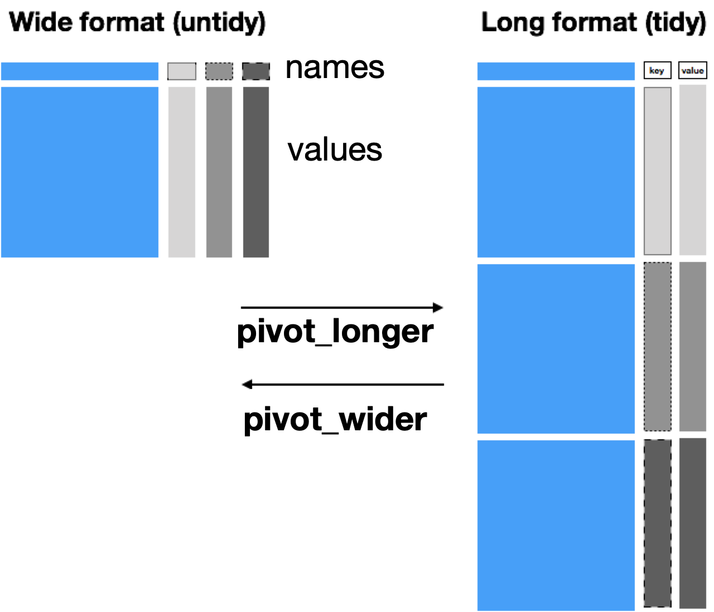

# French fries data

```{r warning = FALSE, message = FALSE}
library(tidyverse)
data(french_fries, package="reshape2")
```

- data from sensory experiment conducted at Iowa State University in 2004

- investigators were interested in comparing effects of three different fryer oils on taste of fries

```{r}
french_fries %>% head()
```

---

# Pivot to long



---


# Gather/Pivot to long

```{r}
ffm <- french_fries %>% 
  pivot_longer(cols = potato:painty, 
               names_to = "scale", 
               values_to = "score")
ffm
```

